# Main Features

In simple words, Next JS is a full stack framework where it uses React for front-end and it supports API routes for backend.

Next JS is a pre-rendered React app in the client-side that users can view and interact with and consider as front-end. At the same time, it also does server-side rendering and API routes which can perform server-side code and access data in the database and can be considered as back-end

Next JS is used to build full feature rich production ready application as it supports routing, authentication, bundle optimization, API routes etc without any configuration or third party packages.

Next JS follows conventions and opinions over configurations. It provides everything for the developer so that the developer can focus more on code than configuration.

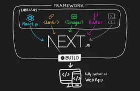

Here are the important features of Next JS

1. File based routing
File based routing (page based routing mechanism) is the feature provided by Next JS inorder to not install any third party packages and avoid configurations. The files and folders created inside pages folder is associated with routes based on file and folder name. So we can create routes as we want by mix and matching the folder and file names.

This mechanism also provides support for dynamic pages.

Catch all routing is possible where we can use same page for different url’s. This can be used for pages with optional query parameters or for filtering options. Example — ecommerce site with different filters routes to the same layout but the content will be different based on the filter.

In client side routing, navigating via link can be done by Link component and navigating programmatically can also be done with useRouter hook provided by Next JS. For example if onclick of link or button needs to route to another page the above features can be used.

Routes without specific file in pages folder will show 404 page by default. Customization can also be done.

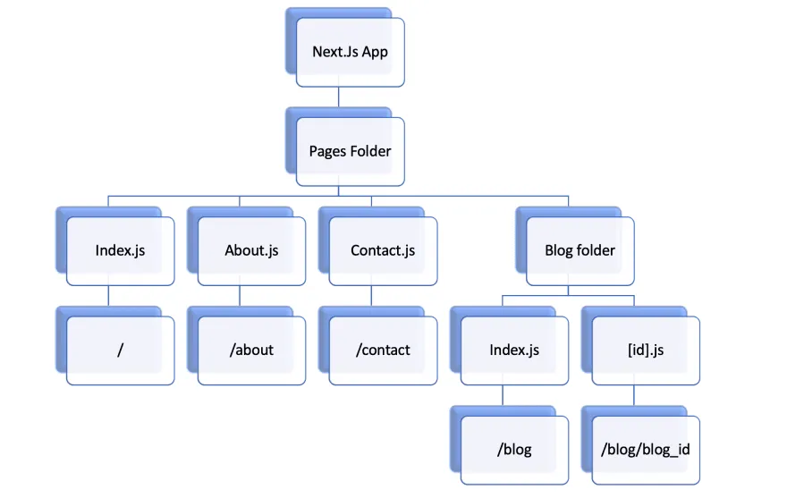

2. Pre-rendering
Pre-rendering is the most powerful feature where the HTML for every pages in Next JS app are generated in advance with all the neccessary content. So if user requests for a page, server will serve the already generated HTML within milliseconds. This provides better performance. Next JS also contributes for SEO as the search engine finds easy to search for keywords when the HTML is fully generated by server and metadata are available for it to crawl and index in better rankings.

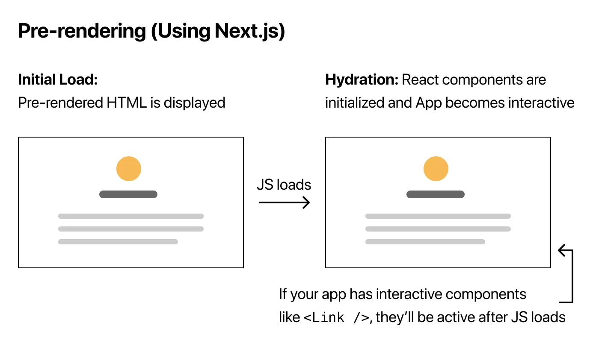

It has hybrid support of rendering with both static site generation(SSG) and server side rendering(SSR). We can also make use of client side rendering(CSR) along with SSG and SSR based on our application.

Static site generation(SSG) can be done by exporting getStaticProps function in the pages. The HTML will be pre-rendered at the build time. If the page needs external data, the data will be fetched first and then the HTML will be generated at the build time.

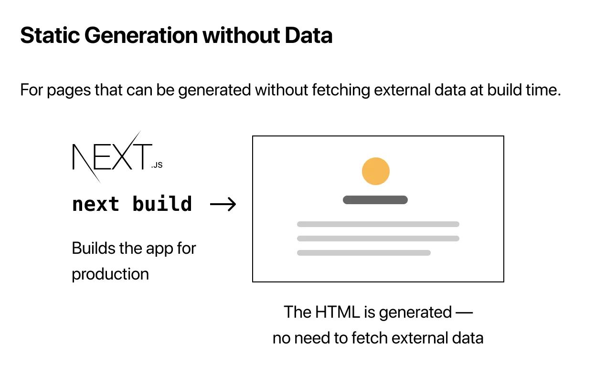

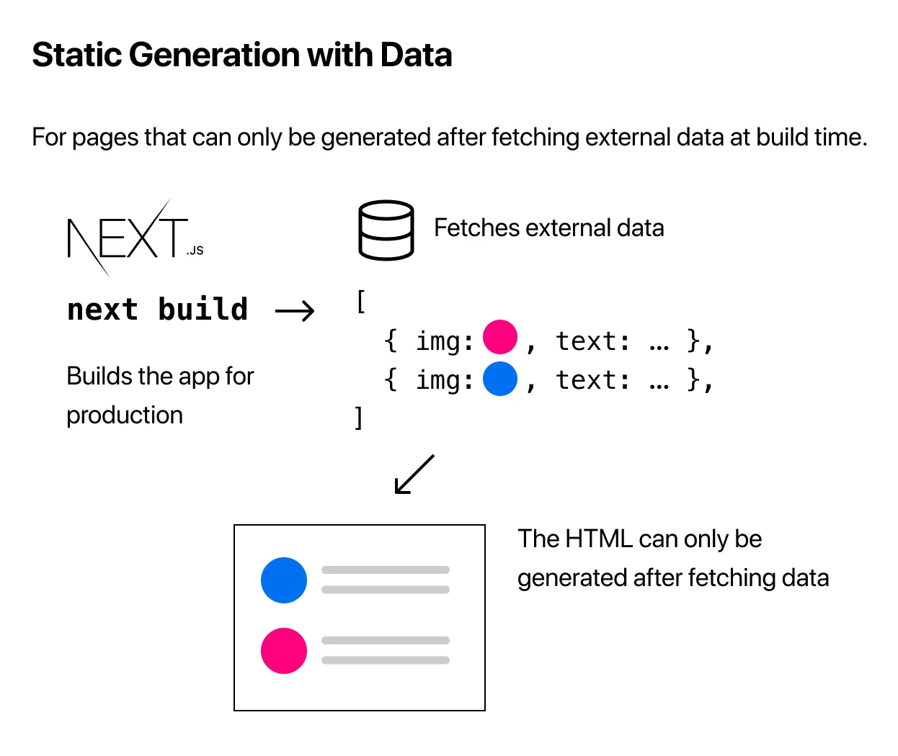

But for each and every change in data we need to rebuild the server inorder to reflect the changes in browser. We can use SSG in Marketing and blogging sites as this sites require less changes.

This has disadvantages of build time and stale data.
Build time will be proportional to the number of pages used in application. This can be reduced by using fallback key which provides the flexibility to generate few popular pages at the build time, other pages at the request time for the initial load and this newly generated pages will be tracked for the subsequent requests. But this is suitable only for applications that has 90% dynamic pages and 10% static pages not for applications with 10% dynamic pages and 90% static pages.

Stale data issue can be fixed if the pages are regenerated for request after some time limit or for every request.

So here comes the Incremental static generation(ISR) to overcome the stale data disadvantage of static site generation to an extent. In ISR only when server gets request after the time limit given in revalidate key, the regeneration will be initiated and the new regenerated HTML will be served. We can use ISR in documentation and e-commerce sites.

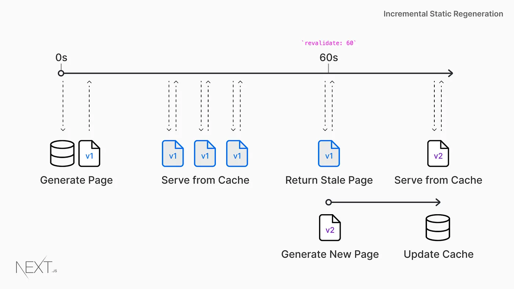

But if we need our application not to render stale data even for fraction of second then we need to use Server side rendering(SSR) where HTML will be generated in every request time. But this may slow down the application. We can use SSR for sites that cannot have stale data even for a second like news sites and other sensitive websites.

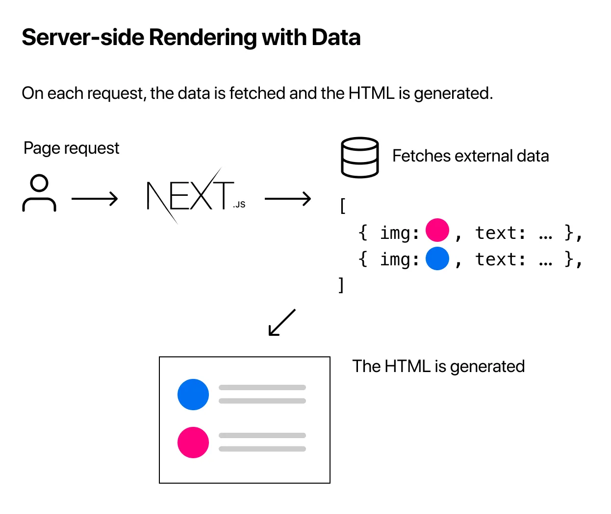

So we can also use Client side rendering(CSR) for applications that are behind login screen or highly user specific or SEO can be less important. Google crawlers improved the crawling for CSR but if the JS bundle size is too large then the crawler will crawl the empty HTML as it takes more time to load and execute JS, and then compile and mount the HTML.

It is possible to pre-render pages using SSG or SSR and can filter with client side data fetching using shallow routing.

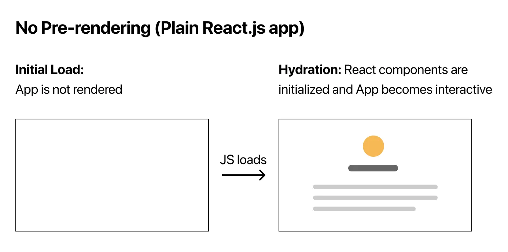

Stale-while-revalidate(SWR) is the react hook library for data fetching created by Next JS team. This provides many features and is simpler to use instead of using useState and useEffect hooks for client side data fetching.

It is always good to use SSG whenever possible instead of SSR or CSR.

3. API Routes
Next JS has in-built support for API routes. We need to add files related to API routes in api folder so this will automatically create routes for API’s based on file and folder name. This is more similar to file based routing.

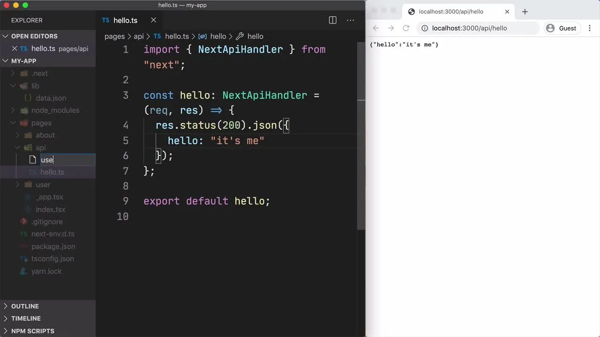

4. CSS modules
Next JS provides extensive support for CSS.

a. Global css needs to be imported in _app.js file so this css will be available for every pages. The same thing applies for external css libraries like bootstrap etc.
b. Component specific css should be included in filename.module.css files. This is locally scoped. So it is possible to have same classname among different component specific css files. This will not collides with other component specific css files or global files. This component specific files need to be imported in specific components.
c. For SASS or SCSS css install sass package and include css in filename.module.scss or filename.module.sass. These files need to be imported in specific components.
d. Inline css can be used by using normal style attribute.
e. CSS frameworks like styled-component, tailwind, emotion etc can also be used in Next JS.

5. Authentication
Next JS has great support for client side authentication, server side authentication, API routes authentication and way to persist user data in any database of our choice. Routes like GET, POST, PATCH, DELETE, dynamic API routes and catch all routes are supported.
uthentication providers can also be used with Next JS.

Next JS team suggests to use Next-auth library for full featured authentication system with built-in providers (Google, Facebook, GitHub…), JWT, JWE, email/password, magic links and more.

6. Development and production build system
Next JS provides development and well optimized production build system so that we can focus more on code than on configuration.
Next JS also supports hot reloading.
For development server, even in static site generation(SSR) the server pre-renders HTML for every request as it is logical because when developing the app it is time consuming to rebuild the app for every change.

7. Image component
Image component is used for image size and format optimization.
All images are loaded in webp format in browsers and image size depends on width, height mentioned in image component and also device resolution instead of original image’s size.
Lazy loading of images is also supported.
Image component has support for placeholder too so till the image loads placeholder will be displayed. This avoids blank space or loading indicator.

8. Head component
Head component is used for providing header with title and description about application as this tags are not be available by default. As crawler checks for header title and metadata with description, this head component results in better SEO rankings

9. Application Layout
Application layout can be handled in single _app.js file where the wrapper component can be wrapped with any layout components like header or footer if needed.
Layout provided in _app.js is the same layout that will be applied for every pages in the application. If we don’t need the same layout for every page we have option to customize the layout.

10. Typescript
Typescript is the integrated feature of Next JS. Create empty tsconfig.json file and install typescript the configuration will be automatically updated in tsconfig.json. Now we are ready to use default types as well as custom types in our app.

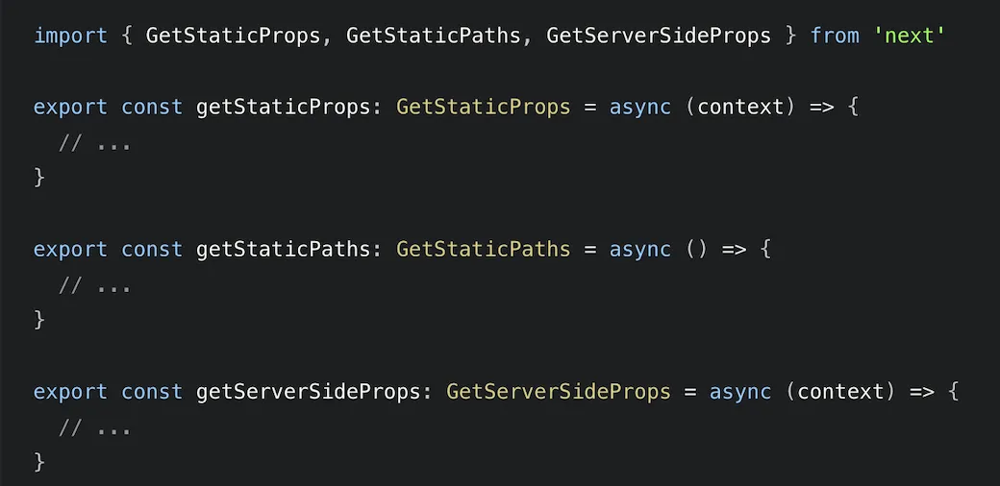

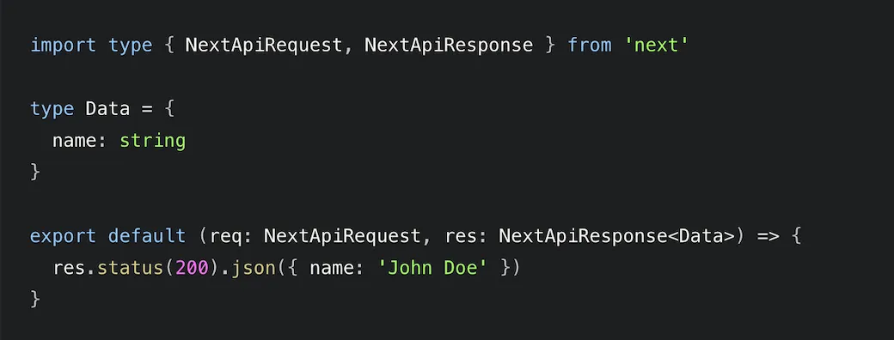

In the above images, default types from Next JS like GetStaticProps, GetStaticPaths, GetServerSideProps NextApiRequest, NextApiResponseand custom type like Data are used.
